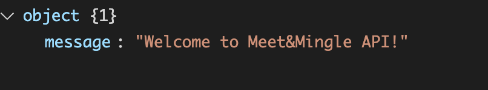
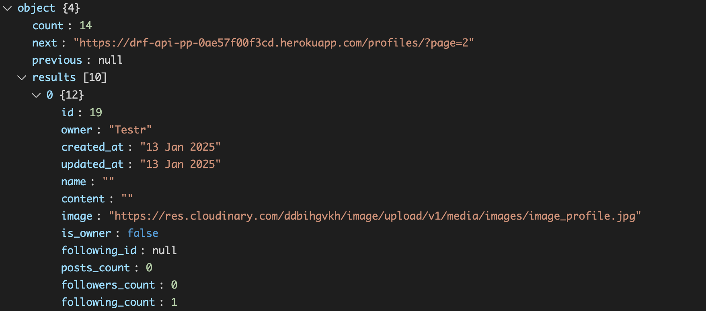

# drf-api

Welcome! This project provides the backend services and API endpoints for the meetandmingle platform, developed as part of my advanced frontend specialization at Code Institute.

Visit the deployed API here → [API](https://drf-api-pp-0ae57f00f3cd.herokuapp.com/) 
Visit the frontend repository here → [Frontend](https://github.com/Ann-Anahit/p5-advanced-frontend)

## Content

- [Project](#project)
  * [Objective](#objective)
- [Project Structure](#project-structure)
  * [Developer User Stories](#developer-user-stories)
- [Database Design](#database-design)
  * [Models](#models)
- [Features](#features)
  * [Home Page](#home-page)
  * [Profiles](#profiles)
  * [Posts](#posts)
  * [Category](#postcategory)
  * [Followers](#followers)
  * [Comments](#comments)
  * [Likes](#likes)
  * [Event](#event)
  * [Followers](#followers)

- [Testing](#testing)
- [Deployment](#deployment)
- [Fork](#fork)
- [Clone](#clone)
- [Credits](#credits)

# Project

## Objective

Meet & Mingle is a social platform designed to bring people together by sharing and discovering local events and activities. Whether you're looking to meet new friends, join exciting events, or organize gatherings in your area, Meet & Mingle makes it easy to connect with like-minded individuals.

## Project Structure

Due to time constraints, much of the project's workflow was adapted from the DRF API walkthrough. This allowed for the inclusion of several key components from the original guide, ensuring a strong foundation while enabling additional customization to meet the assessment criteria of PP5.

## Developer User Stories

You can find the User Stories here: [GitHub Project](https://github.com/users/Ann-Anahit/projects/5/views/1).

# Database Design

## Models

The relationships between these models are illustrated in the entity-relationship diagram below.

[Back to top](<#content>)

# Features

The backend of the project consists of a page for profiles, events, followers, comments and favorites.

## Home Page

When entering the API for the first time, the user is greeted by a simple welcome message.

[Back to top](<#content>)

## Profiles

On the profiles page you can see a list of profiles and each profile contains the owner, created_at, updated_at, name, bio and image fields. The is_owner, following_id, events_count, followers_count, following_count have been added to the serializer.

[Back to top](<#content>)

## Posts

On the Posts page, you can see a list of posts with the fields owner, created_at, updated_at, title, description, image, content and updated_at. The serializer added the fields is_owner, profile_id, profile_image, favorite_id, comments_count, category, hashtags and inspiration.

## Categories

On the Category page, you can see a list of the 5 categories. The admin can edit and delite the categories. 

## Events

On the event page, you can see a list of events with the fields owner, created_at, updated_at, title, description, image, description, duration event_start, location. The serializer added the fields is_owner, profile_id, profile_image, favorite_id, comments_count, 

[Back to top](<#content>)

## Followers

The followers template contains five fields: id, owner, created_at, followed and followed_name fields.

[Back to top](<#content>)

## Comments

The comments model is quite simple and contains the id, owner, created_at, updated_at and content fields. Through the serializer I've added the is_owner, profile_id, profile_image and post fields.

[Back to top](<#content>)

## Likes

And lastly we have likes, which contain the owner, post and created_at fields. 

[Back to top](<#content>)

# Testing

Please click [here](TESTING.md) to go to the testing document.

[Back to top](<#content>)

# Technologies Used

## Languages

* [Python] - Provides the functionality for the DRF backend framework.

[Back to top](<#content>)

## Frameworks & Software

* [Django Rest Framework](https://www.django-rest-framework.org/)
* [PEP8 Validation](https://pep8ci.herokuapp.com/)
* [Github](https://github.com/)
* [Heroku](https://www.heroku.com/)
* [Cloudinary](https://cloudinary.com/)
* [Lucidchart](https://lucidchard.com/)

[Back to top](<#content>)

## Libraries

* asgiref
* cloudinary
* dj-database-url
* dj-rest-auth
* Django
* django-allauth
* django-cloudinary-storage
* django-cors-headers
* django-filter
* django-rest-framework
* djangorestframework-simplejwt
* gunicorn
* oauthlib
* Pillow
* psycopg2
* PyJWT
* python3-openid
* pytz
* requests-oauhlib
* sqlparse

[Back to top](<#content>)

## Deployment

The application has been deployed from GitHub to Heroku by following the steps:

1. Create or log in to your account at [Heroku](https://www.heroku.com/).
2. Create a new app, add a unique app name and then choose your region.
3. Click on Create App.
4. Go to "Settings".
5. Under Config Vars add a key "PORT" and value "8000".
6. Add required buildpacks (further dependencies). For this project, set it up so Python will be on top and Node.js on bottom.
7. Go to "Deploy" and select "GitHub" in "Deployment method".
8. To connect Heroku app to your Github repository code enter your repository name, click "Search" and then "Search" when it shows below.
9. Choose the branch you want to build your app from.
10. If preferred, click on "Enable Automatic Deploys", which keeps the app up to date with your GitHub repository.
11. Wait for the app to build. Once ready you will see the “App was successfully deployed” message and a "View" button to take you to your deployed link.

[Back to top](<#contents>)

## Fork

1. Log in to GitHub.
2. Go to the repository for the project.
3. Click the Fork button in the top right corner.

[Back to top](<#content>)

## Clone

1. Log in to GitHub.
2. Go to the repository for the project.
3. Click on the **green code button** and select if you would like to clone with HTTPS, SSH or GitHub CLI and copy the link below.
4. Navigate to the directory where you want to clone the repository and open terminal.
5. Type *git clone* into the terminal and paste the link you have from number 3. Press enter. This command will download the entire repository to your local machine.

[Back to top](<#content>)

# Credits

* The biggest part of my backend is based on CI's DRF API.

[Back to top](<#content>)